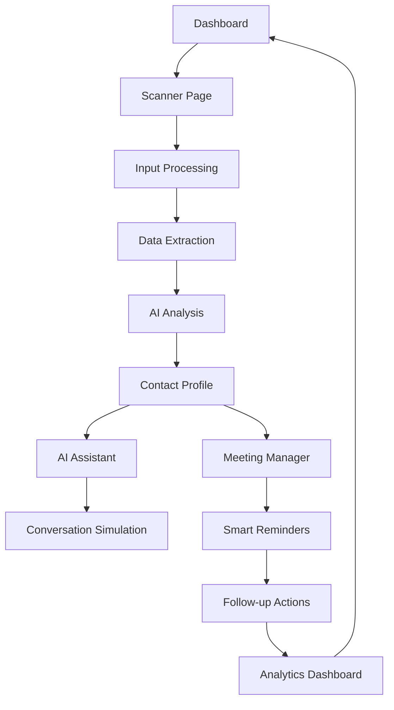

# Networking Co-Pilot - AI-Powered Professional Relationship Management System
## Product Requirements Document

## 1. Product Overview
Networking Co-Pilot is an advanced AI-powered professional relationship management system that transforms traditional networking into a powerful, data-driven experience. The platform combines multimodal input processing, intelligent data analysis, and AI-powered conversation simulation to help professionals build authentic, contextual, and actionable connections.

The system addresses the critical challenge of meaningful professional networking by instantly retrieving and analyzing professional data from multiple sources (name tags, business cards, IDs, LinkedIn profiles), generating real-time background notes, highlighting shared interests, and providing AI-powered conversation assistance. Target users include business professionals, sales teams, recruiters, entrepreneurs, and anyone seeking to enhance their networking effectiveness.

The product aims to capture a significant portion of the $4.2 billion professional networking and CRM market by providing unprecedented networking intelligence and relationship management capabilities.

## 2. Core Features

### 2.1 User Roles
| Role | Registration Method | Core Permissions |
|------|---------------------|------------------|
| Free User | Email registration | Basic profile scanning, 10 contacts/month, standard conversation starters |
| Pro User | Subscription upgrade | Unlimited scanning, advanced AI features, meeting reminders, analytics dashboard |
| Enterprise User | Team invitation | Team collaboration, advanced analytics, custom integrations, priority support |

### 2.2 Feature Module
Our Networking Co-Pilot system consists of the following main pages:
1. **Dashboard**: contact management hub, recent interactions, upcoming meetings, analytics overview
2. **Scanner Page**: multimodal input interface for name tags, business cards, IDs, and LinkedIn profiles
3. **Contact Profile**: detailed contact view with AI-generated insights, conversation history, shared interests
4. **AI Assistant**: conversational interface for simulated interactions and networking advice
5. **Meeting Manager**: smart reminders, previous discussion summaries, follow-up suggestions
6. **Analytics Dashboard**: relationship mapping, networking insights, performance metrics
7. **Settings**: profile management, privacy controls, integration settings

### 2.3 Page Details

| Page Name | Module Name | Feature description |
|-----------|-------------|---------------------|
| Dashboard | Contact Hub | Display recent contacts with quick actions, search and filter capabilities, contact status indicators |
| Dashboard | Activity Feed | Show recent interactions, meeting summaries, follow-up reminders with timeline view |
| Dashboard | Quick Stats | Display networking metrics, connection growth, meeting success rates with visual charts |
| Scanner Page | Camera Interface | Real-time camera feed for scanning name tags, business cards, and IDs with overlay guides |
| Scanner Page | Upload Interface | Drag-and-drop file upload for images and documents with format validation |
| Scanner Page | LinkedIn Input | URL input field with auto-validation and profile preview functionality |
| Scanner Page | OCR Processing | Text extraction from images with confidence scoring and manual correction options |
| Contact Profile | Profile Summary | Display extracted professional data, photo, current role, company information |
| Contact Profile | Insights Panel | AI-generated background notes, shared interests, conversation topics, mutual connections |
| Contact Profile | Interaction History | Timeline of meetings, messages, notes with search and filter capabilities |
| Contact Profile | Action Center | Quick actions for scheduling meetings, sending messages, adding notes, setting reminders |
| AI Assistant | Chat Interface | Conversational AI for networking advice, conversation simulation, relationship insights |
| AI Assistant | Profile Simulation | AI persona based on contact's profile for practice conversations and strategy development |
| AI Assistant | Networking Coach | Personalized advice for relationship building, follow-up strategies, meeting preparation |
| Meeting Manager | Calendar Integration | Sync with Google Calendar, Outlook, and other calendar systems with two-way updates |
| Meeting Manager | Smart Reminders | Context-aware notifications with contact background, previous discussions, suggested topics |
| Meeting Manager | Follow-up Tracker | Automated follow-up suggestions, task management, relationship maintenance schedules |
| Analytics Dashboard | Relationship Map | Visual network graph showing connections, relationship strength, interaction frequency |
| Analytics Dashboard | Performance Metrics | Networking ROI, conversion rates, relationship growth trends with exportable reports |
| Analytics Dashboard | Insights Engine | AI-powered recommendations for networking opportunities, relationship improvements |
| Settings | Profile Management | User profile editing, professional information, networking preferences |
| Settings | Privacy Controls | Data sharing preferences, contact visibility settings, export/delete options |
| Settings | Integrations | Connect CRM systems, social media accounts, calendar applications with OAuth |

## 3. Core Process

**Primary User Flow - Contact Discovery:**
1. User opens Scanner Page and selects input method (camera, upload, or LinkedIn URL)
2. System processes input using OCR, computer vision, or LinkedIn API integration
3. AI extracts and normalizes professional data into structured format
4. System generates comprehensive contact profile with AI insights and conversation starters
5. User reviews and saves contact to their network with optional notes and tags

**AI Assistant Interaction Flow:**
1. User selects contact and opens AI Assistant for conversation simulation
2. AI creates persona based on contact's professional background and interests
3. User practices conversations, receives coaching, and develops networking strategies
4. System provides real-time feedback and suggestions for relationship building

**Meeting Management Flow:**
1. User schedules meeting with contact through integrated calendar system
2. System automatically generates pre-meeting briefing with contact background and discussion topics
3. Smart reminders sent with contextual information and suggested conversation starters
4. Post-meeting follow-up suggestions generated based on meeting outcomes and relationship goals

## 4. User Interface Design

### 4.1 Design Style
- **Primary Colors**: Professional Blue (#1E40AF) and Accent Teal (#0D9488) with gradient overlays
- **Secondary Colors**: Neutral Gray (#64748B) for text, Clean White (#FFFFFF) for backgrounds, Success Green (#10B981)
- **Button Style**: Modern rounded corners (12px), subtle shadows with depth, smooth hover transitions, gradient backgrounds
- **Font**: Inter font family, 18px base size, 32px for headings, 14px for metadata, medium weight for emphasis
- **Layout Style**: Card-based design with generous whitespace, sidebar navigation, responsive grid layouts, floating action buttons
- **Icons**: Heroicons and Lucide React for consistency, outline style with 2px stroke width, contextual color coding

### 4.2 Page Design Overview

| Page Name | Module Name | UI Elements |
|-----------|-------------|-------------|
| Dashboard | Contact Hub | Grid layout with contact cards, profile images, status indicators, search bar with filters, infinite scroll |
| Dashboard | Activity Feed | Timeline design with timestamps, interaction icons, expandable details, real-time updates |
| Scanner Page | Camera Interface | Full-screen camera view, overlay guides for optimal scanning, capture button, flash toggle |
| Scanner Page | Upload Zone | Drag-and-drop area with visual feedback, file type indicators, progress bars, preview thumbnails |
| Contact Profile | Profile Header | Large profile image, name and title typography, company logo, social media links, action buttons |
| Contact Profile | Insights Panel | Tabbed interface for different insight categories, expandable cards, visual interest indicators |
| AI Assistant | Chat Interface | Message bubbles with typing indicators, voice input button, conversation history, quick actions |
| Meeting Manager | Calendar View | Monthly/weekly/daily views, color-coded events, drag-and-drop scheduling, conflict detection |
| Analytics Dashboard | Metrics Cards | KPI cards with trend indicators, interactive charts, drill-down capabilities, export options |
| Settings | Form Layouts | Organized sections with clear labels, toggle switches, dropdown menus, save confirmation |

### 4.3 Responsiveness
The application follows a mobile-first responsive design approach with breakpoints at 640px (mobile), 768px (tablet), 1024px (desktop), and 1280px (large desktop). Mobile optimization includes touch-friendly interfaces for scanning, swipe gestures for navigation, optimized camera controls, and adaptive layouts that prioritize essential features on smaller screens. The scanner functionality is specifically optimized for mobile devices with enhanced camera controls and real-time processing feedback.