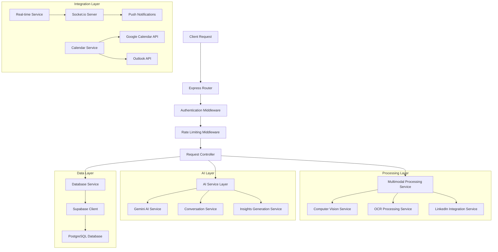
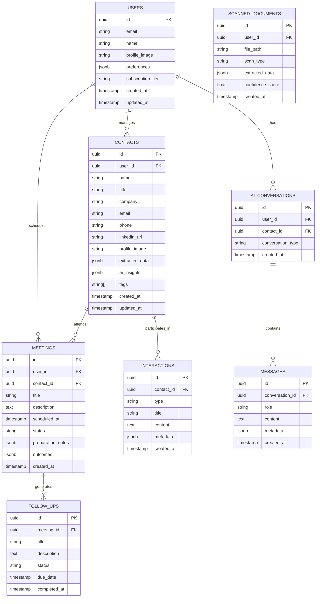

# Networking Co-Pilot - AI-Powered Professional Relationship Management System
## Technical Architecture Document

## 1. Architecture Design

```mermaid
graph TD
    A[User Browser] --> B[React Frontend Application]
    B --> C[Express.js Backend API]
    C --> D[Multimodal Processing Services]
    C --> E[Gemini AI Service]
    C --> F[Supabase Database]
    C --> G[Computer Vision Service]
    C --> H[OCR Processing Engine]
    C --> I[LinkedIn API Integration]
    C --> J[Calendar Integration APIs]
    C --> K[Real-time Notification Service]

    subgraph "Frontend Layer"
        B
    end

    subgraph "Backend Layer"
        C
        D
        G
        H
    end

    subgraph "Data Layer"
        F
    end

    subgraph "External Services"
        E
        I
        J
        L[Google Calendar API]
        M[Outlook Calendar API]
        N[Twilio/SendGrid]
    end

    subgraph "AI & Processing"
        O[Computer Vision Models]
        P[OCR Engine (Tesseract)]
        Q[NLP Processing]
    end

    D --> O
    D --> P
    D --> Q
    J --> L
    J --> M
    K --> N
```

## 2. Technology Description

- **Frontend**: React@18 + TypeScript + TailwindCSS@3 + Vite + Framer Motion + React Query
- **Backend**: Node.js@20 + Express@4 + TypeScript + Multer + Sharp + Socket.io
- **Database**: Supabase (PostgreSQL) + Real-time subscriptions + Row Level Security
- **AI Services**: Google Gemini Pro + Computer Vision API + Tesseract OCR
- **Authentication**: Supabase Auth + OAuth integrations
- **File Storage**: Supabase Storage for images and documents
- **Real-time**: Socket.io for live notifications and updates
- **Calendar**: Google Calendar API + Microsoft Graph API
- **Notifications**: Twilio SMS + SendGrid Email + Push notifications

## 3. Route Definitions

| Route | Purpose |
|-------|---------|
| / | Dashboard with contact overview and recent activity |
| /scanner | Multimodal input interface for scanning and data capture |
| /contacts/:id | Detailed contact profile with AI insights |
| /ai-assistant | Conversational AI interface for networking guidance |
| /meetings | Meeting management and calendar integration |
| /analytics | Relationship analytics and networking insights |
| /settings | User preferences and integration management |
| /api/scan/camera | Process camera-captured images (name tags, business cards) |
| /api/scan/upload | Handle file uploads for document processing |
| /api/scan/linkedin | LinkedIn profile URL processing |
| /api/contacts | CRUD operations for contact management |
| /api/ai/chat | AI assistant conversation endpoint |
| /api/ai/simulate | Contact persona simulation for practice |
| /api/meetings | Meeting scheduling and reminder management |
| /api/analytics | Networking metrics and relationship insights |

## 4. API Definitions

### 4.1 Core API

**Multimodal Scanning Endpoint**
```
POST /api/scan/camera
```

Request (multipart/form-data):
| Param Name | Param Type | isRequired | Description |
|------------|------------|------------|-------------|
| image | file | true | Captured image of name tag, business card, or ID |
| scanType | string | true | Type of scan: 'nametag', 'businesscard', 'id' |
| userId | string | true | Authenticated user ID |

Response:
| Param Name | Param Type | Description |
|------------|------------|-------------|
| success | boolean | Processing status |
| extractedData | object | Structured professional data |
| confidence | number | OCR confidence score (0-100) |
| suggestions | array | Manual correction suggestions |

**LinkedIn Profile Processing**
```
POST /api/scan/linkedin
```

Request:
| Param Name | Param Type | isRequired | Description |
|------------|------------|------------|-------------|
| linkedinUrl | string | true | LinkedIn profile URL |
| userId | string | true | Authenticated user ID |

Response:
| Param Name | Param Type | Description |
|------------|------------|-------------|
| success | boolean | Processing status |
| profileData | object | Comprehensive LinkedIn data |
| aiInsights | object | Generated insights and conversation starters |
| sharedInterests | array | Mutual connections and interests |

**AI Assistant Chat**
```
POST /api/ai/chat
```

Request:
| Param Name | Param Type | isRequired | Description |
|------------|------------|------------|-------------|
| message | string | true | User message to AI assistant |
| contactId | string | false | Context contact for personalized advice |
| conversationId | string | true | Chat session identifier |

Response:
| Param Name | Param Type | Description |
|------------|------------|-------------|
| response | string | AI assistant response |
| suggestions | array | Follow-up action suggestions |
| insights | object | Networking insights and recommendations |

**Contact Management**
```
GET /api/contacts
POST /api/contacts
PUT /api/contacts/:id
DELETE /api/contacts/:id
```

**Meeting Management**
```
POST /api/meetings/schedule
GET /api/meetings/upcoming
POST /api/meetings/reminders
```

Example Response - Contact Creation:
```json
{
  "success": true,
  "contact": {
    "id": "uuid-contact-id",
    "name": "Sarah Johnson",
    "title": "Senior Product Manager",
    "company": "TechCorp Inc.",
    "email": "sarah.johnson@techcorp.com",
    "phone": "+1-555-0123",
    "linkedinUrl": "https://linkedin.com/in/sarahjohnson",
    "profileImage": "https://storage.url/profile.jpg",
    "extractedData": {
      "skills": ["Product Management", "Agile", "Data Analytics"],
      "experience": [
        {
          "company": "TechCorp Inc.",
          "title": "Senior Product Manager",
          "duration": "2022-Present",
          "description": "Leading product strategy for B2B SaaS platform"
        }
      ],
      "education": [
        {
          "school": "Stanford University",
          "degree": "MBA",
          "field": "Business Administration",
          "year": "2020"
        }
      ]
    },
    "aiInsights": {
      "backgroundNotes": "Experienced product leader with strong analytical background...",
      "conversationStarters": [
        "I'd love to hear about your transition from analytics to product management at TechCorp",
        "Your Stanford MBA must have been valuable for your product strategy work"
      ],
      "sharedInterests": ["Product Strategy", "Data-Driven Decision Making"],
      "networkingOpportunities": ["Potential collaboration on B2B products"]
    },
    "interactionHistory": [],
    "tags": ["Product Management", "B2B SaaS", "Stanford Alumni"],
    "createdAt": "2024-01-15T10:30:00Z",
    "updatedAt": "2024-01-15T10:30:00Z"
  }
}
```

## 5. Server Architecture Diagram



## 6. Data Model

### 6.1 Data Model Definition



### 6.2 Data Definition Language

**Users Table**
```sql
-- Create users table
CREATE TABLE users (
    id UUID PRIMARY KEY DEFAULT gen_random_uuid(),
    email VARCHAR(255) UNIQUE NOT NULL,
    name VARCHAR(255) NOT NULL,
    profile_image TEXT,
    preferences JSONB DEFAULT '{}',
    subscription_tier VARCHAR(50) DEFAULT 'free' CHECK (subscription_tier IN ('free', 'pro', 'enterprise')),
    created_at TIMESTAMP WITH TIME ZONE DEFAULT NOW(),
    updated_at TIMESTAMP WITH TIME ZONE DEFAULT NOW()
);

-- Enable RLS
ALTER TABLE users ENABLE ROW LEVEL SECURITY;

-- Create policies
CREATE POLICY "Users can view own profile" ON users FOR SELECT USING (auth.uid() = id);
CREATE POLICY "Users can update own profile" ON users FOR UPDATE USING (auth.uid() = id);

-- Grant permissions
GRANT SELECT, UPDATE ON users TO authenticated;
GRANT SELECT ON users TO anon;
```

**Contacts Table**
```sql
-- Create contacts table
CREATE TABLE contacts (
    id UUID PRIMARY KEY DEFAULT gen_random_uuid(),
    user_id UUID REFERENCES users(id) ON DELETE CASCADE,
    name VARCHAR(255) NOT NULL,
    title VARCHAR(255),
    company VARCHAR(255),
    email VARCHAR(255),
    phone VARCHAR(50),
    linkedin_url TEXT,
    profile_image TEXT,
    extracted_data JSONB DEFAULT '{}',
    ai_insights JSONB DEFAULT '{}',
    tags TEXT[] DEFAULT '{}',
    created_at TIMESTAMP WITH TIME ZONE DEFAULT NOW(),
    updated_at TIMESTAMP WITH TIME ZONE DEFAULT NOW()
);

-- Create indexes
CREATE INDEX idx_contacts_user_id ON contacts(user_id);
CREATE INDEX idx_contacts_name ON contacts(name);
CREATE INDEX idx_contacts_company ON contacts(company);
CREATE INDEX idx_contacts_tags ON contacts USING GIN(tags);
CREATE INDEX idx_contacts_created_at ON contacts(created_at DESC);

-- Enable RLS
ALTER TABLE contacts ENABLE ROW LEVEL SECURITY;

-- Create policies
CREATE POLICY "Users can manage own contacts" ON contacts FOR ALL USING (auth.uid() = user_id);

-- Grant permissions
GRANT ALL PRIVILEGES ON contacts TO authenticated;
```

**Meetings Table**
```sql
-- Create meetings table
CREATE TABLE meetings (
    id UUID PRIMARY KEY DEFAULT gen_random_uuid(),
    user_id UUID REFERENCES users(id) ON DELETE CASCADE,
    contact_id UUID REFERENCES contacts(id) ON DELETE CASCADE,
    title VARCHAR(255) NOT NULL,
    description TEXT,
    scheduled_at TIMESTAMP WITH TIME ZONE NOT NULL,
    status VARCHAR(50) DEFAULT 'scheduled' CHECK (status IN ('scheduled', 'completed', 'cancelled', 'rescheduled')),
    preparation_notes JSONB DEFAULT '{}',
    outcomes JSONB DEFAULT '{}',
    created_at TIMESTAMP WITH TIME ZONE DEFAULT NOW()
);

-- Create indexes
CREATE INDEX idx_meetings_user_id ON meetings(user_id);
CREATE INDEX idx_meetings_contact_id ON meetings(contact_id);
CREATE INDEX idx_meetings_scheduled_at ON meetings(scheduled_at);
CREATE INDEX idx_meetings_status ON meetings(status);

-- Enable RLS
ALTER TABLE meetings ENABLE ROW LEVEL SECURITY;

-- Create policies
CREATE POLICY "Users can manage own meetings" ON meetings FOR ALL USING (auth.uid() = user_id);

-- Grant permissions
GRANT ALL PRIVILEGES ON meetings TO authenticated;
```

**AI Conversations Table**
```sql
-- Create ai_conversations table
CREATE TABLE ai_conversations (
    id UUID PRIMARY KEY DEFAULT gen_random_uuid(),
    user_id UUID REFERENCES users(id) ON DELETE CASCADE,
    contact_id UUID REFERENCES contacts(id) ON DELETE SET NULL,
    conversation_type VARCHAR(50) DEFAULT 'general' CHECK (conversation_type IN ('general', 'simulation', 'coaching')),
    created_at TIMESTAMP WITH TIME ZONE DEFAULT NOW()
);

-- Create messages table
CREATE TABLE messages (
    id UUID PRIMARY KEY DEFAULT gen_random_uuid(),
    conversation_id UUID REFERENCES ai_conversations(id) ON DELETE CASCADE,
    role VARCHAR(20) NOT NULL CHECK (role IN ('user', 'assistant', 'system')),
    content TEXT NOT NULL,
    metadata JSONB DEFAULT '{}',
    created_at TIMESTAMP WITH TIME ZONE DEFAULT NOW()
);

-- Create indexes
CREATE INDEX idx_ai_conversations_user_id ON ai_conversations(user_id);
CREATE INDEX idx_messages_conversation_id ON messages(conversation_id);
CREATE INDEX idx_messages_created_at ON messages(created_at);

-- Enable RLS
ALTER TABLE ai_conversations ENABLE ROW LEVEL SECURITY;
ALTER TABLE messages ENABLE ROW LEVEL SECURITY;

-- Create policies
CREATE POLICY "Users can manage own conversations" ON ai_conversations FOR ALL USING (auth.uid() = user_id);
CREATE POLICY "Users can manage own messages" ON messages FOR ALL USING (
    auth.uid() = (SELECT user_id FROM ai_conversations WHERE id = conversation_id)
);

-- Grant permissions
GRANT ALL PRIVILEGES ON ai_conversations TO authenticated;
GRANT ALL PRIVILEGES ON messages TO authenticated;
```

**Initial Data Setup**
```sql
-- Insert sample conversation starters (from existing system)
INSERT INTO conversation_starters (category, subcategory, question, tags) VALUES
('career_background', 'experience', 'What drew you to your current role at [company]?', ARRAY['experience', 'career']),
('soft_skills', 'leadership', 'How do you approach building and leading high-performing teams?', ARRAY['leadership', 'management']),
('personality_motivation', 'goals', 'What professional goal are you most excited about right now?', ARRAY['goals', 'motivation']);

-- Create functions for real-time updates
CREATE OR REPLACE FUNCTION update_updated_at_column()
RETURNS TRIGGER AS $$
BEGIN
    NEW.updated_at = NOW();
    RETURN NEW;
END;
$$ language 'plpgsql';

-- Create triggers
CREATE TRIGGER update_users_updated_at BEFORE UPDATE ON users FOR EACH ROW EXECUTE FUNCTION update_updated_at_column();
CREATE TRIGGER update_contacts_updated_at BEFORE UPDATE ON contacts FOR EACH ROW EXECUTE FUNCTION update_updated_at_column();
```